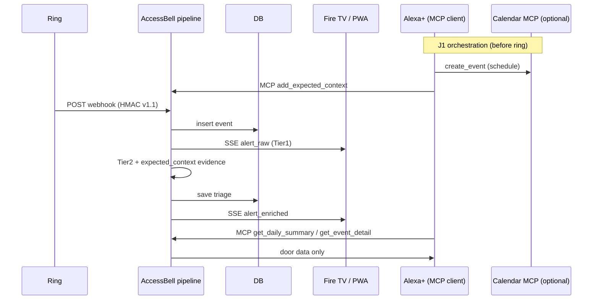

# AccessBell — Architecture

Technical design for AccessBell: **door-intelligence layer** for accessibility and independent living.  
Surfaces: **Fire TV (visual)** · **Alexa+ (voice / MCP orchestrator)** · **Ring (events)** · **AWS Bedrock (optional LLM)**.

---

## 1. Goals

| Goal | Non-goal (MVP) |
|---|---|
| Accessible door alerts (visual + voice + one-tap) | Face recognition / identity proof |
| Evidence-grounded LLM triage | 24/7 video analytics in the cloud |
| Consent-based sharing | Always-on caregiver surveillance |
| Event-driven, local-first demo | Outdoor two-way intercom STT |
| **Door-intelligence MCP** beside other household MCPs | Multi-tenant SaaS / full calendar product |

---

## 1b. Multi-MCP household (system context)

AccessBell is **one MCP server + one event pipeline**, not the whole smart home.

| Component | Protocol | Role |
|---|---|---|
| Ring cloud | HTTPS webhook (HMAC-SHA256, Partner API v1.1) | Device signals (`button_press`, `motion_detected`, …) |
| **AccessBell backend** | FastAPI | Ingest, Tier1/2, escalation, DB, SSE UI |
| **AccessBell MCP** | Streamable HTTP JSON-RPC (`POST /mcp`) | Door tools for agents |
| Calendar MCP *(external)* | Streamable HTTP (any compliant server) | Household schedule |
| **Alexa+** | MCP **client** | Orchestrates tools by intent; voice UX |
| Fire TV web / PWA | HTTP + SSE | Captions, D-pad replies |
| Notifier | pluggable | Consent SMS / announce (mock in demo) |

```
  Calendar MCP  ◄──┐
                   │  tools/call (schedule)
  Resident ──voice──► Alexa+ (MCP client)
                   │  tools/call (door intent, alerts, replies, escalation)
                   ▼
              AccessBell MCP ◄── same process ── AccessBell pipeline
                   ▲                                 ▲
                   │                                 │ webhook HMAC
              Fire TV / PWA ◄── SSE ──┤             Ring cloud
                   ▲                                 │
                   └──── consent notify / share ─────┘
```

**Join patterns**

| Pattern | Flow | Default |
|---|---|---|
| **J1 Orchestrator** | Alexa+ writes Calendar MCP (optional) **and** `add_expected_context` on AccessBell | **Primary** |
| **J2 Pipeline** | Tier 2 may call Calendar MCP `list_events` if `CALENDAR_MCP_URL` set | **Off** |

**Honest bound:** Alexa+ MCP Toolkit does not expose Google/Outlook calendars to a single add-on.
AccessBell stores **door intent** explicitly provided; it does not scrape private calendars.

**What only AccessBell owns:** webhook verify + debounce/idempotency · Tier1 latency path ·
evidence gate (demote without evidence) · consent escalation + audit · EN/VI TTS-safe captions ·
door memory (labels, expected context).

---

## 2. High-level diagram (AccessBell process)

```
                         ┌──────────────────────┐
                         │     Ring Cloud       │
                         │  doorbell / motion   │
                         └──────────┬───────────┘
                                    │ HTTPS webhook (HMAC-SHA256, X-Signature)
                                    │ Partner API v1.1 envelope
                                    ▼
┌───────────────────────────────────────────────────────────────┐
│                     AccessBell Backend                        │
│                        (FastAPI)                              │
│                                                               │
│  ┌─────────────┐   ┌──────────────┐   ┌────────────────────┐  │
│  │  Webhook    │──►│  Ingest &    │──►│  Tier 1 Rules      │  │
│  │  /webhooks/ │   │  Idempotency │   │  (<200ms classify) │  │
│  │  ring       │   │  + Debounce  │   └─────────┬──────────┘  │
│  └─────────────┘   └──────────────┘             │             │
│         ▲                                       ▼             │
│         │                              ┌────────────────────┐  │
│  ┌──────┴──────┐                       │ Tier 2 Enrichment │  │
│  │ Mock engine │                       │ Bedrock / stub    │  │
│  │ MOCK_MODE   │                       │ + expected_context│  │
│  └─────────────┘                       └─────────┬──────────┘  │
│                                                  │             │
│  ┌─────────────┐   ┌──────────────┐              │             │
│  │  SQLite /   │◄──┤  Persist     │◄─────────────┘             │
│  │  Postgres   │   │  event +     │                            │
│  │             │   │  triage +    │                            │
│  │  events,    │   │  labels +    │                            │
│  │  expected,  │   │  escalation  │                            │
│  │  share log  │   └──────────────┘                            │
│  └──────┬──────┘                                               │
│         │                                                      │
│         │   ┌─────────────────────────────────────────────┐    │
│         └──►│ Dispatcher                                  │    │
│             │  • SSE bus for Fire TV / PWA                │    │
│             │  • Optional announce / SMS                  │    │
│             └─────────────────────────────────────────────┘    │
│                              │                                 │
│             ┌────────────────┼────────────────┐                │
│             ▼                ▼                ▼                │
│      ┌────────────┐  ┌─────────────┐  ┌──────────────┐         │
│      │ Fire TV    │  │ Phone PWA   │  │ MCP Server   │         │
│      │ web (kiosk)│  │ quick reply │  │ /mcp         │         │
│      └────────────┘  └─────────────┘  └──────┬───────┘         │
└──────────────────────────────────────────────┼─────────────────┘
                                               │ Streamable HTTP
                                               ▼
                    ┌──────────────┐    ┌─────────────┐
                    │ Calendar MCP │◄──►│   Alexa+    │
                    │ (optional)   │    │ MCP client  │
                    └──────────────┘    └─────────────┘
```

---

## 3. Runtime flows

### 3.1 Doorbell → alert (happy path)

```
Ring ding
  → POST /webhooks/ring  (verify HMAC)
  → insert Event(status=ingested)
  → Tier1: raw category from event type
  → SSE: { type: "alert_raw", text: "Someone is at the door" }
  → async Tier2:
        load expected_context + today's stats
        call Bedrock (structured output)
        update Event(triage JSON)
        SSE: { type: "alert_enriched", caption, color, confidence, evidence }
  → optional Alexa announce adapter
```

### 3.2 User ground truth (multi-turn memory)

```
User: quick reply or MCP confirm_event(event_id, label="pharmacy")
  → store Label(event_id | pattern_key)
  → future events with similar window/device use prior as evidence
```

### 3.3 Voice Q&A (multi-MCP)

```
User → Alexa+ (MCP client)
         ├─ optional: Calendar MCP list/create events
         └─ AccessBell MCP get_daily_summary / get_door_alerts / add_expected_context
              → AccessBell DB
```

Example: *“Alexa, expect pharmacy around 10”* → calendar tool (if connected) + `add_expected_context`;
later ring uses that window as Tier 2 evidence. With `CALENDAR_MCP_URL` set (J2, default OFF),
AccessBell also reads a Calendar MCP `list_events` at enrich time and cites `calendar:` evidence.
AccessBell answers **door** questions only from its own store — it does not invent calendar entries.

### 3.4 Low confidence

```
confidence < threshold
  → caption stays generic: "Someone is at the door"
  → evidence lists only what is known
  → prompt guardrail: do not invent person/package identity
```

### 3.5 Escalation (consent-based safety net)

```
enriched triage.urgency >= policy.min_urgency  AND  policy.enabled
  → persist pending row (escalation_pending.fire_at) + schedule task
  → user replies/confirms (PWA or MCP) within window
        → pending claimed/deleted; escalation_log: status=stopped  (audit)
  → timeout expires (or process restarted: recover() re-arms from fire_at)
        → claim pending (DELETE … rowcount) → exactly one instance fires
        → notify each enabled escalation_contact (mock SMS queue)
        → escalation_log: status=queued (audit)
        → SSE: { type: "escalation_sent", contacts, timeout_seconds }
  → contact revoked → never notified again
```

Durable by design: the timer lives in the DB, so a crash/restart/scale-to-zero between the alert
and the deadline still delivers. Claiming is a single conditional DELETE, so N instances cannot
double-notify.

---

## 4. Components

### 4.1 Backend modules

| Module | Responsibility |
|---|---|
| `main.py` | FastAPI app: API routes, SSE `/api/stream`, MCP endpoint, wiring |
| `config.py` | Typed env settings (`Settings` dataclass) |
| `webhook.py` | Ring Partner API v1.1 parse (`parse_ring_payload`), payload hint extraction, HMAC verify, `request_id` idempotency + debounce |
| `ring_client.py` | Devices/history REST (live mode, httpx; `api.amazonvision.com`) |
| `captions.py` | EN/VI presentation strings (single source); TTS-safety + length helpers |
| `triage.py` | Tier 1 rules + Tier 2 `EnrichmentPipeline`; pydantic `TriageResult` |
| `llm/__init__.py` | `build_llm(settings)` provider factory |
| `llm/base.py` | `TriageLLM` protocol |
| `llm/stub.py` | Deterministic offline provider (no deps) |
| `llm/langchain_provider.py` | All live LLMs via one LangChain `ChatModel` + `with_structured_output(TriageResult)` |
| `brief.py` | Aggregate day → personal digest (EN/VI) |
| `escalation.py` | `EscalationManager`: timeout tasks, acknowledge/cancel, audit rows |
| `mcp_server.py` | MCP tools over Streamable HTTP (JSON-RPC 2.0) |
| `calendar_mcp.py` | Optional Calendar MCP **client** (J2): `list_events` → `calendar:` evidence, budget-bounded |
| `metrics.py` | In-memory latency histograms + counters for `/api/metrics` (disposable) |
| `policy.py` | `policy.yaml` version + SHA, cited by escalation audit and `/api/policy` |
| `notifier.py` | Pluggable announce/SMS (no-op in mock) |
| `db.py` | Repository facade; picks dialect from `DB_URL` |
| `storage/sqlite.py` / `storage/postgres.py` | Dialects: connect, SQL translation, schema, insert-id |
| `schema.sqlite.sql` / `schema.postgres.sql` | DDL per dialect |
| `oauth.py` | OAuth 2.1 resource-server verification (JWKS, scopes, `Cf-Access-Jwt-Assertion`) |
| `escalation.py` | `EscalationManager`: durable pending rows + resume-on-boot + acknowledge/audit |
| `util.py` | `RateLimiter`, ISO-8601 helpers |

### 4.2 HTTP API (implemented)

| Endpoint | Method | Purpose |
|---|---|---|
| `/health` | GET | liveness + mode |
| `/` | GET | Fire TV / PWA UI |
| `/api/stream` | GET | SSE live alerts (`alert_raw`, `alert_enriched`) |
| `/webhooks/ring` | POST | Ring events (HMAC, rate-limited, debounced) |
| `/api/simulate?fixture=` | POST | Inject mock fixture (optional `DEMO_TOKEN`) |
| `/api/events[?since&until&limit]` | GET | Event history |
| `/api/events/{id}` | GET | Single-event read-back (verify state written by another path) |
| `/api/events/{id}/reply` | POST | Quick reply (`leave_at_door`/`coming`/`not_now`/`waiting_for_parent`) |
| `/api/events/{id}/confirm` | POST | Ground-truth label |
| `/api/expected` | GET/POST | Door calendar: list / add expected-context windows |
| `/api/expected/{id}` | DELETE | Revoke a door-intent window |
| `/api/brief[?date&lang]` | GET | Daily summary (EN/VI) |
| `/api/share/preview` | POST | Plan step: build the message, no write, no consent needed |
| `/api/share` | POST | Consent-driven share (requires `consent: true`) |
| `/api/share/log` | GET | Share read-back (audit) |
| `/api/share/{id}/revoke` | POST | Revoke a share (append-only audit row) |
| `/api/policy` | GET | Active `policy.yaml` version + SHA |
| `/api/metrics` | GET | Fixture-derived counters: status, grounding, escalation, latency timers |
| `/api/ui-strings` | GET | UI labels EN/VI (single source in `captions.py`) |
| `/api/advise` | GET | Read-only suggestions (never auto-writes) |
| `/api/escalation/stop` | POST | Acknowledge + stop a pending escalation from the UI |

`/api/*` is gated by `API_TOKEN` when `API_AUTH_DISABLED=false` (Bearer, `?token=`, or cookie);
`/webhooks/ring` uses HMAC and `/mcp` uses OAuth/JWT or the demo token.
| `/api/prefs` | GET/POST | Accessibility profile (`caption`/`voice`/`both`) |
| `/api/escalation/contacts` | GET/POST | Trusted contacts (user-added = consent); `DELETE .../{id}` revokes |
| `/api/escalation/policy` | GET/POST | `enabled`, `timeout_seconds`, `min_urgency` (default off / 90s / 7) |
| `/api/escalation/log` | GET | Audit trail of escalation sent/stopped |
| `/mcp` | POST | MCP JSON-RPC over Streamable HTTP (OAuth 2.1 JWT, or `MCP_HTTP_TOKEN` in demo mode) |
| `/.well-known/oauth-protected-resource` | GET | RFC 9728 discovery (resource URI, AS, scopes) |
| `/api/ring/devices` | GET | Live Ring devices (only when token configured) |

### 4.3 Data model (SQLite / Postgres)

```sql
events(
  id, source, device_id, kind, occurred_at,
  raw_json, status, triage_json, created_at, event_hash
)

expected_context(
  id, kind, label, window_start, window_end, source, created_at
)

labels(
  id, event_id, pattern_key, label, confirmed_at, source
)

share_log(
  id, brief_date, recipient, message, created_at
)

access_prefs(
  id, mode, language, updated_at
)

escalation_contacts(
  id, label, recipient, channel, enabled, created_at, revoked_at
)

escalation_policy(
  id=1, enabled, timeout_seconds, min_urgency
)

escalation_log(
  id, event_id, contact_id, recipient, message, status, created_at
)   -- status: queued | stopped | failed

escalation_pending(
  event_id, fire_at, timeout_seconds, created_at
)   -- durable timer: survives restart; claimed (deleted) exactly once when fired
```

`events.event_hash` is a **unique index** (portable, NULLs allowed): Ring `meta.request_id` is hashed
so webhook retries are deduped by lookup instead of scanning recent rows.

DDL ships per dialect (`schema.sqlite.sql`, `schema.postgres.sql`); the repository translates
placeholders/`now()`/`RETURNING id` so the same method calls work on both.

### 4.4 TriageResult schema (LLM contract)

```json
{
  "category": "PACKAGE_DELIVERY | MED_DELIVERY | FAMILY_VISITOR | UNKNOWN_VISITOR | MOTION_ANOMALY",
  "urgency": 0,
  "confidence": 0.0,
  "evidence": ["doorbell", "expected_context:pharmacy", "calendar:pharmacy", "time_pattern"],
  "caption_en": "Possible package delivery at the front door",
  "caption_vi": "Có thể có người giao hàng ở cửa trước",
  "suggested_replies": ["leave_at_door", "coming", "not_now"],
  "do_not_invent": true,
  "grounding": "grounded | generic | demoted_insufficient_evidence",
  "context_status": "ok | timeout | disabled"
}
```

*Sample output; `caption_vi` is shown as data. In the codebase VI strings live only in
`backend/captions.py` (see AGENTS.md).*

Rules:

- Missing snapshot → do not claim visual detail.  
- Missing user label → do not claim named identity.  
- Prefer `UNKNOWN_*` over hallucination.

**Enforced in code** (`triage.py`):

- `TriageResult` is a pydantic model: category is an enum, `confidence` is 0–1,
  `urgency` is 0–10, evidence values must begin with a known source
  (`doorbell | motion | expected_context | calendar | time_pattern | user_label | snapshot`),
  `caption_en` must be non-empty.
- `EnrichmentPipeline` re-validates LLM output; on any validation error it falls back
  to Tier 1 (`ok=False`, status `enrichment_failed`).
- Grounding rule: non-generic categories (`MED_DELIVERY`, `PACKAGE_DELIVERY`,
  `FAMILY_VISITOR`) require grounding signal — evidence from `expected_context` /
  `calendar` / `user_label` / `snapshot`, or an explicit payload hint — otherwise they are
  **demoted** to `UNKNOWN_VISITOR` with `grounding=demoted_insufficient_evidence` (still
  `ok=True`: enrichment succeeded, the system declined to over-claim).
- `grounding` is one of `grounded`, `generic`, `demoted_insufficient_evidence`; the API/SSE
  attach a plain-language `why` line (EN/VI, from `captions.py`) and a child-safe caption.
- `context_status` records the calendar join (`ok` within `CONTEXT_BUDGET_MS`, `timeout`
  fail-open, `disabled` when no Calendar MCP is configured); a timeout is explained in the why-line.
- Generic categories always render the fixed captions so the UI never shows invented text.

---

## 5. Tier design

| Tier | Trigger | Budget | Output |
|---|---|---|---|
| **Tier 1** | Webhook / mock | < 200 ms end-to-end (verify → insert → SSE `alert_raw`) | Raw alert text + event id |
| **Tier 2** | After ingest (async) | ~1–2 s typical | Enriched JSON + captions |

If Bedrock fails or times out → keep Tier 1 result, mark `enrichment=failed`.  
`LLM_PROVIDER=stub` returns deterministic fixtures for offline demo.  
If the model returns a specific claim without grounding, the pipeline keeps a usable result but
records `grounding=demoted_insufficient_evidence` and the generic caption (Tier 1 only).

Latency responsibilities:

- Tier 1 performs **no LLM I/O**; it only classifies by event kind and pushes SSE.
- Tier 2 runs on a detached asyncio task, so a slow model never blocks `alert_raw`.
- `LLM_TIMEOUT_SECONDS` (default 5) bounds the provider call (e.g. Bedrock connect/read timeout
  via `ChatBedrockConverse`); `ENRICH_BUDGET_MS` (default 2000) is enforced with `asyncio.wait_for`
  around enrichment. On timeout the pipeline keeps the Tier 1 result **and still schedules
  escalation**, so the safety net never depends on a model responding.
- `CONTEXT_BUDGET_MS` (default 200) bounds the calendar join; slower calls fail open with
  `context_status=timeout` and the local context is used. Richer context never delays Tier 1.
- Latency histograms (`tier1_ms`, `context_ms`, `enrich_ms`, `mcp_tool_ms`, `webhook_to_sse_ms`)
  are exposed via `/api/metrics`; SLO table lives in the README.

---

## 6. MCP server (door intelligence for agents)

AccessBell’s MCP endpoint is the **door-intelligence server** in a multi-MCP household (see §1b).
Alexa+ (or any MCP client) may also talk to a **Calendar MCP** or other servers; AccessBell does not
proxy those tools.

- **Transport:** Streamable HTTP — `POST /mcp`, JSON-RPC 2.0 message envelope
- **Spec:** [2025-11-25](https://modelcontextprotocol.io/specification/2025-11-25/basic/transports)  
- **Methods implemented:** `initialize`, `ping`, `tools/list`, `tools/call`
  (notifications return HTTP 202; errors use JSON-RPC error codes `-32600/-32601/-32602`)
- **Version negotiation:** `initialize` echoes the client's `protocolVersion` when supported
  (`2025-03-26`, `2025-06-18`, `2025-11-25`, `2026-07-28`), otherwise answers `2025-11-25`
- **Discovery:** `GET /.well-known/oauth-protected-resource` (RFC 8707) advertises the canonical
  `resource` URI, authorization server(s), and supported scopes
- **Alexa+ 401 mode:** set `MCP_401_WWW_AUTHENTICATE=false` so unauthenticated `/mcp` returns bare
  401 (Alexa+ checklist: no `WWW-Authenticate` yet). Default `true` keeps RFC 9728 challenge for
  other clients.

### 6.1 Authentication (two-tier OAuth 2.1)

Following the Alexa+ MCP Toolkit checklist (OAuth 2.1, PKCE S256):

| Tier | Grant | Scope | Can call `tools/call`? |
|---|---|---|---|
| Service | `client_credentials` (HTTP Basic + `resource` param) | `mcp:service` | ❌ (discovery/ping only) |
| User | `authorization_code` + PKCE S256 | `mcp:tools mcp:resources` | ✅ (acts for the linked user) |

- All tokens are verified server-side: **JWKS discovery** (auto from `OAUTH_ISSUER` or
  `OAUTH_JWKS_URL`), RS256 signature, issuer + audience, expiration, optional `resource` claim
  (RFC 8707) enforced via `OAUTH_REQUIRE_RESOURCE`.
- **IdP-agnostic**: same verification works against Amazon Cognito, Okta, or any RFC 8414
  authorization server; switching IdP = env change. Cognito is recommended for the AWS-only story
  (custom scope `mcp:service` on a user pool app client; user tier with auth-code grant + PKCE).
  Okta is equally compliant; Firebase Auth is **not** a fit for the service tier (no
  `client_credentials` for a third-party OAuth client).
- **Offline/demo mode**: when `OAUTH_ISSUER` is empty, `/mcp` falls back to the local
  `MCP_HTTP_TOKEN` bearer check so the mock demo runs with zero external accounts.
- A service token cannot act for a user (returns HTTP 403 on `tools/call`) — the MCP
  "discover-only" principle.
- **401 + discovery:** RFC 9728 `WWW-Authenticate` when `MCP_401_WWW_AUTHENTICATE=true` (default).
  Alexa+ production mode sets it **false** (toolkit does not use that header yet).
- **Cloudflare Access:** with `CF_ACCESS_JWT_ENABLED=true`, a valid `Cf-Access-Jwt-Assertion` is
  treated as user-tier (Access policies already authorized the user). Cloudflare's Python runtime
  can't host this app as-is — run it in Containers / behind a proxy, or keep Cloudflare for TLS.

Smoke test with a JWT (see `tests/test_oauth.py` for a self-contained stub IdP):

```bash
# service token -> can list, cannot act
curl -s -X POST localhost:8080/mcp -H "Authorization: Bearer $SERVICE_JWT" -H 'Content-Type: application/json' \
  -d '{"jsonrpc":"2.0","id":1,"method":"tools/list"}'
# user token -> full tools/call
curl -s -X POST localhost:8080/mcp -H "Authorization: Bearer $USER_JWT" -H 'Content-Type: application/json' \
  -d '{"jsonrpc":"2.0","id":2,"method":"tools/call","params":{"name":"get_daily_summary","arguments":{}}}'
```

Smoke test without an MCP client:

```bash
curl -s -X POST localhost:8080/mcp -H 'Content-Type: application/json' \
  -H 'Authorization: Bearer change-me' \
  -d '{"jsonrpc":"2.0","id":1,"method":"tools/list"}'

curl -s -X POST localhost:8080/mcp -H 'Content-Type: application/json' \
  -H 'Authorization: Bearer change-me' \
  -d '{"jsonrpc":"2.0","id":2,"method":"tools/call","params":{"name":"get_daily_summary","arguments":{}}}'
```  

### Tool catalog (MVP — AccessBell MCP only)

| Tool | Args | Returns |
|---|---|---|
| `get_door_alerts` | `since`, `urgency_min` | list of alerts |
| `get_event_detail` | `event_id` | event + triage + evidence |
| `get_context_snapshot` | `event_id` | local context inputs (expected/labels/hints) + calendar flag |
| `get_daily_summary` | `date?` | brief bullets + stats |
| `add_expected_context` | `kind`, `label`, `window_start`, `window_end` | id — **door intent** for J1 orchestration |
| `list_expected_context` | `limit?` | active/upcoming door-intent windows |
| `clear_expected_context` | `id` or `label` | removed count (revoke door intent) |
| `confirm_event` | `event_id`, `label` | ok (also stops pending escalation) |
| `send_quick_reply` | `event_id`, `action` | dispatched status (also stops pending escalation) |
| `update_accessibility_prefs` | `mode`, `language` | ok |
| `set_escalation` | `enabled`, `contact_label`, `contact_recipient`, `timeout_seconds` | policy + contact id |

Not in this server (live in other MCPs / future): calendar CRUD, `ask_door_history`.

Any MCP client (Alexa+, curl, agent host) can call `/mcp`. Calendar tools belong on a **Calendar
MCP**, not on AccessBell — Alexa+ orchestrates both.

---

## 7. Surfaces

### Fire TV web (primary visual)

- Static/SPA served by FastAPI (`web/`, installable PWA: manifest + icon)  
- SSE `/api/stream` for live alerts; `alert_raw` carries `latency_ms` for an on-screen badge  
- Large typography, WCAG-oriented contrast, `prefers-reduced-motion`, clock outside the live region  
- Urgency shown as **text + color**; grounding badge (`Grounded` / `Generic, no evidence yet`) and a
  why-line from `captions.why_text`; child mode swaps to a calm caption and two large actions  
- Escalation shows a **countdown + Stop**; door-calendar and share/consent panels are built in  
- EN/VI switch driven by `/api/prefs`; UI labels come from `/api/ui-strings` (no VI strings in JS)  
- Optional on-device voice via `speechSynthesis` when the profile is voice/both  
- Demo: browser or Fire TV simulator (web app allowed by hackathon)

### Phone PWA

- Same UI responsive + big buttons for quick reply  
- Consent share control (preview → consent → log → revoke)  

### Alexa+

- Voice Q&A via MCP  
- Optional announce adapter (skill / proactive path)  

---

## 8. Ring integration details

| Concern | Approach |
|---|---|
| Auth | OAuth / account linking per Ring docs → Bearer token |
| Events | Webhook preferred; poll event history as backup |
| Integrity | HMAC-SHA256 signature header, constant-time `hmac.compare_digest` |
| Sandbox | Synthetic devices; plus local `MOCK_MODE` fixtures |
| Snapshot | Optional; single frame per event, not archived video |
| Idempotency | Dropped if `meta.request_id` was already seen (Partner API retries) |
| Debounce | Else dedupe by `device_id + kind` within `DEBOUNCE_SECONDS` (default 10 s) |
| Time | Event time from `data.attributes.timestamp` (device), then `meta.time` |
| Rate limit | Per-IP limiter on `/webhooks/ring` (`RATE_LIMIT_PER_MINUTE`) |

**Signature scheme (`backend/webhook.py`):**

```
signature = hex(HMAC_SHA256(secret=RING_WEBHOOK_SECRET, message=raw_request_body))
```

- Header is `X-Signature: sha256=<hex>` (`RING_SIGNATURE_HEADER`, default `X-Signature`); the handler
  also accepts the legacy `X-Ring-Signature` alias. The optional `sha256=` prefix is stripped before
  comparison.
- Comparison is constant-time (`hmac.compare_digest`) over the raw request body; tampered payloads →
  HTTP 401.
- `RING_WEBHOOK_ENABLED=false` (default) records events without verification for local demos;
  enable it and set `RING_WEBHOOK_SECRET` before wiring a live callback.
- Verify the exact header name/canonicalization against your Ring app callback config before production.

Reference: [Ring API documentation](https://developer.amazon.com/docs/ring/api-documentation.html)

---

## 9. LLM & model-agnostic triage (LangChain)

| Concern | Approach |
|---|---|
| Framework | `langchain-core` ChatModel interface; one wrapper for every provider |
| Contract | `model.with_structured_output(TriageResult)` — JSON-schema constrained output, framework-enforced |
| Providers | `bedrock` (ChatBedrockConverse), `openai`, `anthropic`, `google`, `ollama` |
| Model selection | `LLM_PROVIDER` env; `LLM_MODEL` optional override (per-provider defaults in `backend/llm/__init__.py`) |
| Keys | `OPENAI_API_KEY` / `ANTHROPIC_API_KEY` / `GOOGLE_API_KEY`; Bedrock uses IAM |
| Failure | Timeout / parse / validation error → Tier 1 only (`LLM_TIMEOUT_SECONDS`) |
| Offline | `stub` needs no network or API keys; core `requirements.txt` stays langchain-free |

The pipeline treats every provider identically: raw event + expected context + prior user labels
→ structured `TriageResult` → pydantic re-validation + grounding guardrail (§4.4).

Reference: [langchain-aws ChatBedrockConverse](https://python.langchain.com/docs/integrations/chat/bedrock/)

---

## 10. Mock strategy (hackathon resilience)

```
MOCK_MODE=true
  → skip live Ring client
  → POST /api/simulate or scripts/demo_local.py
  → fixtures in mock/events/*.json
```

Suggested fixtures:

| File | Story |
|---|---|
| `doorbell_unknown.json` | Generic visitor |
| `doorbell_package_window.json` | Matches expected package window |
| `doorbell_med.json` | Aligns with expected pharmacy context |
| `doorbell_family.json` | Grounded family visit (needs hint/expected context) |
| `motion_only.json` | Noise / pass-by |
| `motion_night.json` | Quiet-hours motion |

This keeps the **demo path deterministic** while live Ring remains a documented integration.

---

## 11. Security & privacy

- Verify webhook signatures; reject unsigned/tampered payloads (401).  
- Do not log full tokens.  
- MCP HTTP: **OAuth 2.1 (JWKS-verified JWT) two-tier** when `OAUTH_ISSUER` is set; service tokens
  cannot act for users; local `MCP_HTTP_TOKEN` fallback only for offline demo; `MCP_ORIGIN`
  allowlist; `/api/simulate` can require `DEMO_TOKEN`.  
- Per-IP rate limiting (default 30 req/min) on webhook + simulate endpoints; limiter prunes keys.  
- `/api/*` requires `API_TOKEN` when `API_AUTH_DISABLED=false` (public deploys); `/`, `/assets` and
  `/health` stay public and the UI bootstraps its cookie from `/?token=…`.  
- No face embeddings store.  
- Share log is explicit and user-initiated (`consent: true`); share revoke is an append-only audit row;
  escalation is default-off and its audit rows cite `policy.yaml` version + SHA (`GET /api/policy`).  
- Events auto-purged after `EVENT_TTL_DAYS` (default 30); `retains_video_archive: false` in `policy.yaml`.  
- SQLite uses WAL + single-writer lock; Postgres uses the same serialized-access facade
  (`DB_URL=postgresql://…`), with rollback on statement error.
- Secrets come from env (demo) or the platform's secret store in production (see README).
- No medical diagnosis APIs or claims.

---

## 12. Deployment sketch

| Env | Host |
|---|---|
| Local demo | `python -m backend` (honors `PORT`) + SQLite |
| Docker | `docker compose up` (volume-backed SQLite), or `scripts/smoke_docker.sh` |
| Cloud / VM | GCP Cloud Run (`scripts/deploy_cloudrun.sh`), any VM/k8s; `DB_URL=postgresql://…` for durable state |
| MCP | Same host `/mcp` with HTTPS (tunnel ok for demo) |

Optional AWS Builder mini: Bedrock + Lambda webhook.

---

## 13. Failure modes

| Failure | Behavior |
|---|---|
| LLM timeout | Tier1 alert stays; UI shows “basic alert”; status `enrichment_failed` |
| LLM invalid JSON / schema | pydantic rejects → Tier 1 fallback (grounding rule also demotes) |
| Ring webhook retry | Debounce by device+kind within `DEBOUNCE_SECONDS` |
| Bad webhook signature | HTTP 401, no event recorded |
| Rate limit exceeded | HTTP 429 on webhook/simulate |
| MCP client down | UI/PWA still works; events still stored |
| Server restart mid-escalation | Durable `escalation_pending` re-armed by `recover()`; overdue fires immediately |
| Multiple instances | Escalation claimed by exactly one (conditional DELETE) |
| No expected context | Generic delivery/unknown captions only |

---

## 14. Tests (pytest) — requirements traceability

Run: `pip install -r requirements-dev.txt && pytest -q` (270 tests collected; skips are Postgres
variants without `TEST_POSTGRES_DSN` and live-LLM extras. Storage tests run on SQLite and, when
`TEST_POSTGRES_DSN` is set, on Postgres too)

| File | Covers |
|---|---|
| `tests/data/triage_cases.json` | Declarative test data: requirement tag + event + expected context + expected outcome |
| `tests/test_triage.py` | Tier 1 mapping (`button_press`/`motion_detected` → doorbell/motion evidence), pydantic validation (confidence, evidence), stub categorization, grounding status (grounded/generic/demoted), calendar grounding |
| `tests/test_calendar.py` | Calendar MCP stub (`create_event`/`list_events`), tool result parsing, client JSON-RPC call, env-gated factory |
| `tests/test_slo.py` | Tier 1 never calls the LLM, calendar timeout follows `CONTEXT_BUDGET_MS`, **enrich budget hard timeout**, budget/timeout metrics, fail-open, `context_status` |
| `tests/test_util.py` | Rate-limiter key pruning; quiet-hours window wrap |
| `tests/test_adversarial.py` | Forged/missing signature rejected, inventing LLM demoted, LLM failure → Tier 1, single-use escalation claim |
| `tests/test_scripts.py` | Ablation arms show grounding contribution; docs-consistency checks pass |
| `tests/test_docker_context.py` | Every `COPY` source in the Dockerfile exists and is not excluded by `.dockerignore` |
| `tests/test_triage_data.py` | Data-driven: taxonomy (5 categories), expected-context windows, quiet-hours motion, child-at-home friend visit, v1.1 `data.attributes` hint, EN/VI captions, generic fallback |
| `tests/test_webhook.py` | HMAC verify (valid/tampered/dev-mode/`sha256=` prefix), Partner API v1.1 parse, `request_id` idempotency beyond debounce, mock fixtures are v1.1, ingest, debounce window, invalid JSON |
| `tests/test_db.py` | Expected-window matching, TTL purge, debounce query, labels, prefs, triage persistence |
| `tests/test_mcp_server.py` | All **8** AccessBell MCP tools, JSON-RPC initialize/-32601/-32602, notifications, evidence in detail |
| `tests/test_api.py` | Full HTTP surface: simulate, webhook+signature (v1.1 envelope, `X-Ring-Signature` alias), quick reply, confirm, brief EN/VI, consent-share+audit, prefs validation, MCP bearer/origin, `MCP_401_WWW_AUTHENTICATE` toggle, SSE broker format |
| `tests/test_escalation.py` | Safety net: policy off by default, fires after timeout w/ audit, reply stops it (REST+MCP), low-urgency skip, revoked contacts never notified, **pending survives restart**, **at-most-once claim** |
| `tests/test_oauth.py` | OAuth 2.1: service/user tiers, JWKS/issuer/aud/exp/resource checks, `WWW-Authenticate` discovery on 401, **Cf-Access-Jwt-Assertion**, local-token fallback |
| `tests/test_captions.py` | Accessibility guardrails: EN+VI present, TTS-safe, length-bounded, Partner API kinds mapped, VI door-word regression, brief templates in both languages |
| `tests/test_storage_dialects.py` | SQL translation per dialect (`?`→`%s`, `now()`, `RETURNING id`, DROP … CASCADE) |
| `tests/test_llm_factory.py` | Provider factory (stub/ollama), unknown provider, missing API key (skipped if no langchain) |

| Requirement (README) | Verified by |
|---|---|
| Event taxonomy (5 categories) | `test_triage_data.py` cases + `test_triage.py` |
| Ring webhook + HMAC | `test_webhook.py`, `test_api.py::test_webhook_rejects_bad_signature` |
| Ring Partner API v1.1 (parse, `request_id` idempotency, `sha256=` prefix) | `test_webhook.py`, `test_api.py::test_webhook_accepts_partner_v11_envelope` |
| Alexa+ bare 401 (`MCP_401_WWW_AUTHENTICATE`) | `test_api.py::test_mcp_401_www_authenticate_toggle` |
| Evidence gate status + demotion | `test_triage.py`, `test_adversarial.py`, `test_api.py::test_event_serialization_includes_why_and_child` |
| Door calendar (`list`/`clear`) + share protocol | `test_mcp_server.py`, `test_db.py`, `test_api.py` |
| Calendar MCP join (J2) | `test_calendar.py`, `test_triage.py::test_pipeline_calendar_evidence_grounds` |
| Docs/data consistency | `scripts/check_docs_consistency.py`, `test_scripts.py` |
| Latency budgets / fail-open | `test_slo.py`, README SLO table, `/api/metrics` timers |
| Context transparency | `test_mcp_server.py::test_get_context_snapshot_is_local_and_read_only` |
| Verify-after-write (verifier ≠ writer) | `test_mcp_server.py::test_verify_after_write_on_a_second_surface`, `test_api.py::test_event_read_back_matches_write` |
| REST auth gate | `test_api.py::test_api_auth_gate_when_enabled` |
| Webhook idempotency by hash | `test_webhook.py::test_db_lookup_by_event_hash`, `::test_handler_dedupes_by_request_id_beyond_debounce` |
| PWA assets + UI shell | `test_api.py::test_pwa_assets_and_index_reference` |
| Advisor is read-only | `test_api.py::test_advisor_suggests_without_writing` |
| Evidence + confidence, no invention | `test_triage_data.py::window_outside_range`, `test_triage.py::test_pipeline_guardrail...` |
| Captions EN/VI | `test_triage_data.py::bilingual_captions` |
| Expected context via voice | `test_triage_data.py::expected_*`, `test_mcp_server.py`, `test_db.py` |
| Quick replies (3 actions) | `test_api.py::test_quick_reply_flow`, `test_mcp_server.py` |
| User confirm → memory | `test_api.py::test_confirm...`, `test_mcp_server.py::test_confirm_event_memory` |
| Daily brief + consent share + audit | `test_api.py::test_brief...`, `test_share_requires_consent_and_logs` |
| MCP tools for Alexa+ (Streamable HTTP) | `test_mcp_server.py`, `test_api.py` MCP endpoint tests |
| Tier 1 <200ms / Tier 2 async degradation | raw-vs-enriched two-phase asserted in `test_api.py::test_simulate_creates_raw_then_enriched` |
| Multi-LLM trial (LangChain) | `test_llm_factory.py` |

---

## 15. Sequence (enriched alert)



---

## 16. Related docs

| Doc | Link |
|---|---|
| Project README | [../README.md](../README.md) |
| Deployment | [DEPLOYMENT.md](DEPLOYMENT.md) |
| MCP transports (2025-11-25) | https://modelcontextprotocol.io/specification/2025-11-25/basic/transports |
| Alexa+ MCP Toolkit | https://developer.amazon.com/docs/alexaplus/add-ons/mcp-toolkit-overview.html |
| Ring Partner API | https://developer.amazon.com/docs/ring/api-documentation.html |
| Fire TV web apps | https://developer.amazon.com/docs/fire-tv/getting-started-with-web-apps.html |
| Bedrock | https://docs.aws.amazon.com/bedrock/latest/userguide/what-is-bedrock.html |
